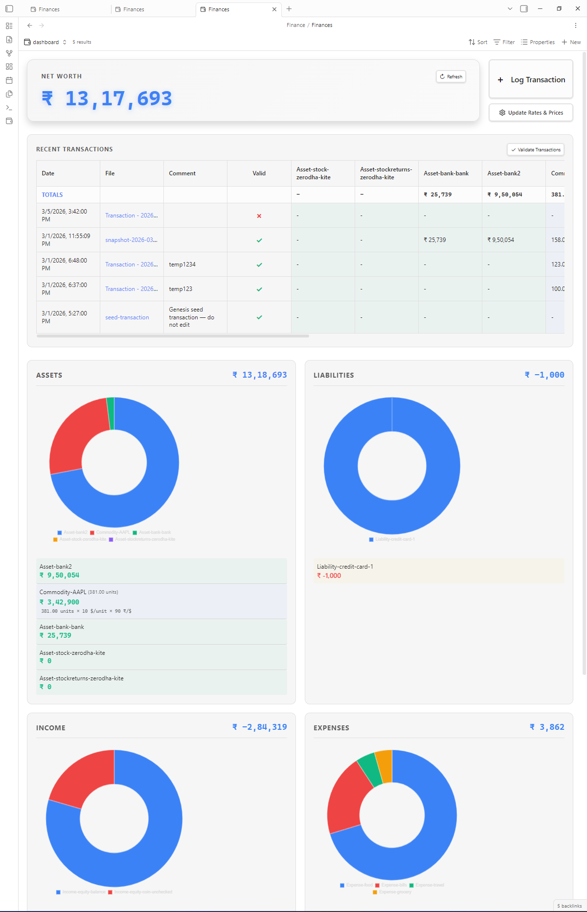

# Personal Finance Plugin for Obsidian

A comprehensive personal finance dashboard for Obsidian, supporting double-entry accounting principles directly within your vault.

## Features

- **Double-Entry Accounting**: Track assets, liabilities, income, and expenses using frontmatter properties in your daily notes or dedicated transaction files. The plugin employs a strict Zero-Sum rule for transaction validity (`Assets - Liabilities + Income - Expenses = 0`).
- **Interactive Dashboard**:
    - **Net Worth**: Real-time calculation and display of your net worth, converting custom currencies and commodity prices on the fly.
    - **Recent Transactions Table**: View recent transactions in an aesthetic, customizable table directly from the dashboard.
    - **Visualizations**: Interactive points-in-time Net Worth line chart, and detailed Doughnut charts for category breakdowns across Assets, Liabilities, Income, and Expenses. Powered by Datacore for hyper-fast querying and caching.
- **Blockchain-Linked Transaction Integrity**:
    - Secures your personal finance history through cryptographic hashing, acting as a genuine ledger.
    - **Validation**: Automatically validates new transactions and seamlessly links them to previous entries using `prev_valid_transaction` and `Prev_valid_transaction_hash`.
    - **Tamper Verification**: Allows you to walk the ledger backwards mathematically to verify the integrity of past transactions. Any modification to a locked transaction will be instantly flagged as an `integrity_error`.
- **Commodity Tracking & Pricing**:
    - Log fractional investments, stocks, and items (e.g., `Commodity-Gold`) inside transactions.
    - Manage real-time exchange rates (like USD to INR) and static prices securely via the dashboard JSON manager. Includes `UnitPrice-` tag for precise accounting of cash equivalent trades.
- **Snapshotting**: Create periodic, static snapshots of your financial state to build historical Net Worth line chart data points indefinitely.
- **Flexible & Customizable**: Customize folders completely natively within settings. 

## Dashboard Page Screenshot


## Installation

### Manual Installation
1.  Create a folder named `personal-finance` inside your vault's `.obsidian/plugins/` directory.
2.  Copy `main.js`, `styles.css`, and `manifest.json` to that folder.
3.  Reload Obsidian and enable "Personal Finance" in Community Plugins settings.

*(Recommended for best compatibility: ensure the plugin folder is named `personal-finance`)*

## Setup & Automated Initial Generation
On your very first load, the plugin will automatically scaffold your personal finance environment securely. 
It drops essential files inside your designated Finance root path:
- `Finances.base`: A BasesView-ready file that renders your entire dashboard interface.
- `Personal-finances-usage-guide.md`: A custom usage guide referencing your unique setup.
- `seed-transaction.md`: Found inside your Transactions folder, serving as the required "Genesis Block" template of your immutable blockchain ledger.

## Usage Guide

### 1. Recording Transactions
You can create a note (e.g., using the autogenerated `Transaction.md` template) inside the Transactions directory, injecting frontmatter metadata describing account movements.

**Valid Prefixes:**
- `Asset-`: Tracks what you own (e.g., `Asset-Bank1`, `Asset-Cash`).
- `Liability-`: Tracks what you owe (e.g., `Liability-CreditCard`, `Liability-Mortgage`).
- `Income-`: Tracks money coming in (e.g., `Income-Salary`).
- `Expense-`: Tracks money going out (e.g., `Expense-Groceries`).
- `Commodity-`: Tracks quantities of non-currency assets (e.g., `Commodity-Gold`).
- `UnitPrice-`: Defines the exact trading point at which a commodity interaction took place in monetary value (helps balance the zero-sum ledger).

**Dynamic Accounts:**
You do not need to manually register separate accounts in Settings. Your dashboard parses accounts strictly by traversing transaction values prefix-by-prefix! For example, assigning `Asset-MySecretBank: 50` creates `MySecretBank` in your Asset slice instantly. Removing the last reference across your files clears the account outright.

**Example Transaction:**
```yaml
---
date: 2024-05-20T10:00
Asset-Cash: -100
Expense-Groceries: 100
---
```

### 2. The Dashboard and Action Commands
Load your dashboard using the ribbon icon (or running "Open finance dashboard"). Ensure the Datacore community plugin is active alongside it to render the views.

The dashboard integrates core functionality via Action Buttons:
- **Refresh**: Manually invalidates and refreshes the Datacore cache in case an external file was added or manually edited.
- **Log Transaction**: Triggers a fast way to initialize new transactions.
- **Update Rates & Prices**: Tweak your current currency multiplier (USD to INR rate) or adjust the `CommodityPrices` JSON data directly via the UI modal.
- **Validate New Transactions**: Checks all loose files. Verifies zero-sum balancing via values and commodity prices, assigns cryptographic hashes if valid, marks `is_valid: true`, and establishes cryptographic ties to their `prev_valid_transaction`.
- **Verify transaction integrity**: Recalculates altered locked files backwards. Any tampered file is dynamically caught and marked with `invalid_reason: integrity_error` so the chain can be manually verified.

### 3. Snapshots and Tracking Real Net Worth
Snapshots exist to archive the current sum of all accounts (Assets & Liabilities). Snapshots are permanently saved directly inside the Snapshots folder as `.md` files. This lets your Net Worth Line graph plot historical wealth without running O(N^2) calculations traversing thousands of old entries, ensuring O(1) fetch times for graphs while keeping the dataset fully resilient against post-transaction timeline adjustments.

## Settings
Go to **Settings > Personal Finance** to configure:
1. **General & Currency**:
   - Master currency assignments (`$`, `₹`).
   - Usd to Inr conversion rate.
   - Commodity Prices tracking JSON.
   - Rows visible on the transaction table view.
2. **File & Folder Structures**: Path adjustments for generation (Root, Transactions, Snapshots, Templates, usage guidelines).
3. **Transaction Integrity**: Toggle `Blockchain-linked verification` entirely ON or OFF.

## Development & Building
1. Clone the repository.
2. `npm install`
3. `npm run dev` (run watcher)
4. `npm run build` (produce minified distribution)

*(Follows Obsidian MD strict styling and isDesktopOnly ecosystem conditions.)*
